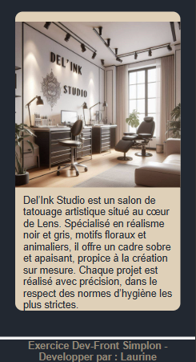

# 🎨 Del'Ink Studio — Site fictif de tatoueur

Ce projet est un site vitrine fictif pour un salon de tatouage, réalisé avec **React** et **SCSS**.  
Il présente les informations essentielles du salon, une galerie interactive et deux formulaires pour prise de rendez-vous et contact.

---

## 🚀 Technologies utilisées

- ⚛️ React ( Vite )
- 🎨 SCSS
- 📦 React Router DOM

---

## 🖥️ Pages disponibles

### 🏠 Accueil
- Présentation du salon et du tatoueur.
- Logo et slogans mis en avant.

### 🖼️ Galerie
- Grille d’images de tatouages.
- Effet **zoom au survol** (hover) pour mettre en valeur les créations.

### 📅 Prise de rendez-vous
- Formulaire avec nom, email, type de tatouage, disponibilité, etc.
- Pas de back-end, données non envoyées (simulation visuelle uniquement).

### 📬 Contact
- Formulaire de contact simple avec nom, email et message.

### ❓ FAQ (Foire Aux Questions)
- Questions fréquentes sur les tatouages, la douleur, les soins, les mineurs, etc.
- Affichage dynamique des réponses avec effet d’ouverture/fermeture (accordion).

---

## 📱 Responsive
- Site adapté aux petits écrans.
- Menu burger animé, qui **se ferme automatiquement** lorsqu’un lien est cliqué.

---

## ✨ Fonctionnalités front-end

- Composants React fonctionnels
- Navigation avec React Router
- Menu burger avec **animation fluide**
- Formulaires stylisés (pas de soumission réelle)
- **Effets CSS** pour interactions utilisateur

---

## 📷 Aperçu (screenshots)

  


---

## 🔧 Lancer le projet en local

```bash
git clone https://github.com/BouchartLaurine/React-Delinkstudio
cd React-Delinkstudio
npm install
npm run dev 


 ```
 ## Tests

Librairie utilisée : **Jest + React Testing Library**


### Test Jest :
- Home Page ✅️
- Galerie ✅️


# React + Vite

This template provides a minimal setup to get React working in Vite with HMR and some ESLint rules.

Currently, two official plugins are available:

- [@vitejs/plugin-react](https://github.com/vitejs/vite-plugin-react/blob/main/packages/plugin-react) uses [Babel](https://babeljs.io/) for Fast Refresh
- [@vitejs/plugin-react-swc](https://github.com/vitejs/vite-plugin-react/blob/main/packages/plugin-react-swc) uses [SWC](https://swc.rs/) for Fast Refresh

## Expanding the ESLint configuration

If you are developing a production application, we recommend using TypeScript with type-aware lint rules enabled. Check out the [TS template](https://github.com/vitejs/vite/tree/main/packages/create-vite/template-react-ts) for information on how to integrate TypeScript and [`typescript-eslint`](https://typescript-eslint.io) in your project.

